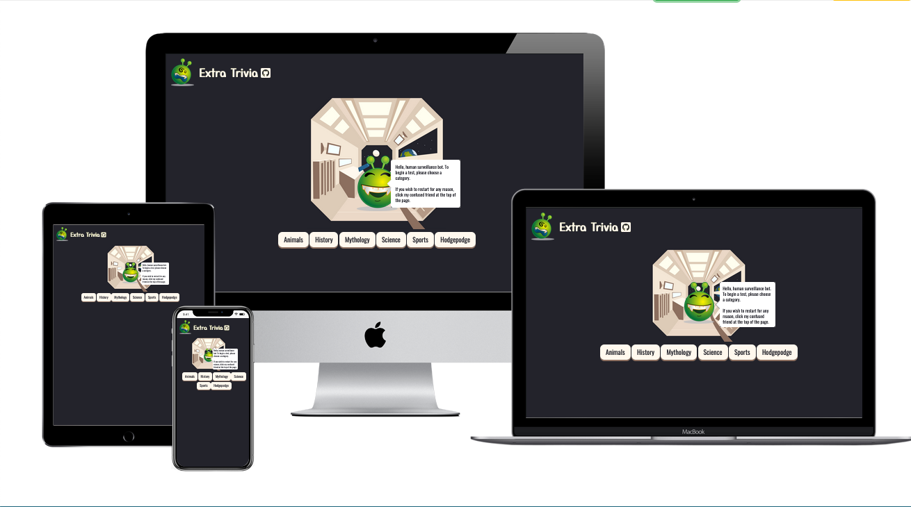
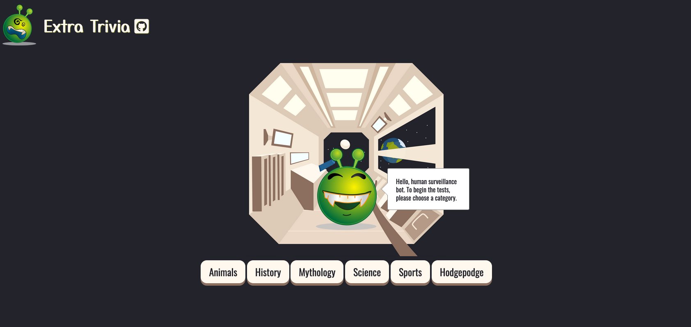
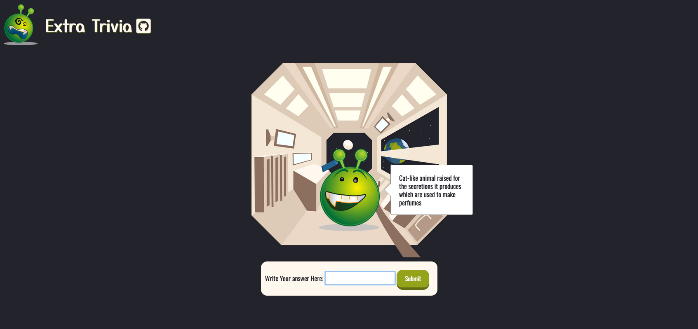
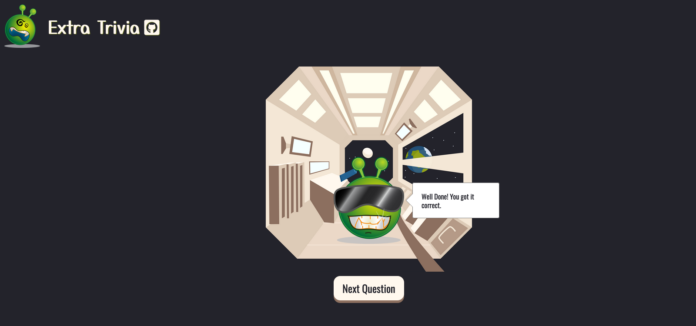
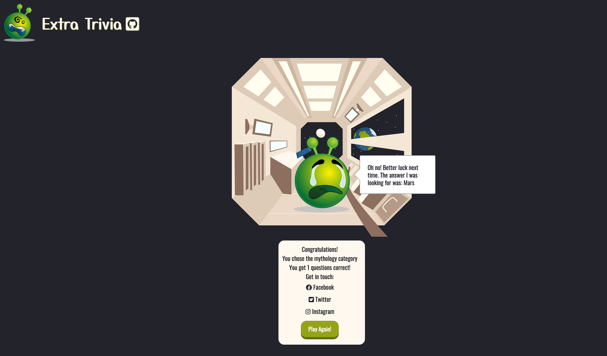

# MS2

This is a trivia website using the jService API and string-similarity API Designed to be eye-catching, interactive & fun.

## User Experience

### User Journey

1. The user begins at the Homepage and should see the simple instructions "Hello, human surveillance bot. To begin the tests, please choose a category. " Which are presented by our alien host.

1. Upon clicking a category the host then prompts the user to start the quiz using the 'Start Quiz' button.
1. This will cause the host to ask his first question. The user can then enter their answer into the form and submit it with the 'Submit' button.

1. The host will then determine whether the user is correct or incorrect.
 - If correct, The user will be allowed to continue to the next question and the quiz will continue. 

 - If incorrect, then unfortunately the user's run is over. A popup appears giving feedback to the user and prompts them to play again.

### User Stories

- First Time Visitor
    - When I visit this site I want to understand how I can interact with the website.
    - I would want to attempt the quiz in a category of my choice.
- Returning Visitor
    - As a returning visitor I may simply be looking to improve my score or try a new category.
    - I may also want to share my interest in the site via social media.
- Frequent User
    - As a frequent user I would consistently be looking to improve my score.
    - I may also be interested in the development of the game.

### Design

- Colour Scheme
    - This will likely be dictated by the creative elements that I find. So with that in mind, I chose a background color that would blend with the central image. For any buttons and text, I will try to use colors from the image so that we have a consistent theme.
- Typography
    - I used Yusei Magic for the header and Oswald elsewhere.
- Imagery
    - I found a selection of emoji expressions that I thought would work well at different moments during a play-through (correct/incorrect etc.). These emojis happened to be of an alien, so I decided to theme my website around space.

- Wireframes
    - I created wireframes for the basic ideas I had and then added more details as I went along. I also made a flowchart to help me envision the steps taken during a playthrough of the quiz.
        - [Home page](documentation/Wireframe/MS2-Wireframe-Homepage.pdf)
        - [Question Page](documentation/Wireframe/MS2-Wireframe-Question.pdf)
        - [Recap Page](documentation/Wireframe/MS2-Wireframe-Recap.pdf)
        - [Flowchart](documentation/Wireframe/MS2-Wireframe-Flowchart.pdf)

## Features

- The website should be responsive across different devices.
- The website allows the user to take a quiz using past "Jeopardy!" questions.
- Users will be able to choose a category and attempt to answer random questions by typing their submission.

### Taking The Project Further

If I were taking the project further there are some features I believe would the website would benefit from:
- I would like the website to record the user's previous attempts so that they can see their own improvement.
- Although the social media icons do lead to their respective websites, I would like a more complete share system that writes a post for the user.

## Technologies

### Languages

- [HTML5](https://en.wikipedia.org/wiki/HTML5)
- [CSS3](https://en.wikipedia.org/wiki/CSS)
- [JS](https://en.wikipedia.org/wiki/JavaScript)

### API's Used

#### [jService](http://jservice.io/)
jService is a simple trivia service that serves the answers/questions pulled from jArchive. The questions are organised into categories which we can use to make a series of themed questions for the user of this website.
- JSON of a category: [JSON](https://jservice.io/api/category?id=21)
- JSON of a random question: [JSON](http://jservice.io/api/random)

You can find instructions as to how to use the jService API on its website. However, I will list the primitive steps that I used to find and select the popular categories I wanted to use:
- Open the [jService](http://jservice.io/) website and scroll down to the bottom of the page.
- Under the 'Popular' heading you will see the 'View Popular Categories' button which you should click.
- Click on any category you would like.
- The URL of that chosen category should look similar to this: **http://jservice.io/popular/103** But your final number may be different.
- That final number in the URL is the ID of that category. You can use this with the API to grab the JSON data.
- Type: **https://jservice.io/api/category?id=** Putting your number after the "=" at the end of the URL to see the JSON data.
- If you **DO NOT** type anything after the "=" the API will throw up a 404 error as it will not find any data.

#### [StringSimilarity](https://www.npmjs.com/package/string-similarity#for-nodejs)
String Similarity finds the degree of similarity between two strings, based on Dice's Coefficient. Returning a fraction between 0 and 1, which is what indicates the similarity of the strings. We can use this in our website to allow for a user's minor spelling mistakes.

### Frameworks, Libraries & Programs Used

1. [jService](https://github.com/sottenad/jService): A trivia API

1. [String-Similarity](https://github.com/aceakash/string-similarity#readme): For testing user answer versus correct answer.

1. [Fetch](https://developers.google.com/web/updates/2015/03/introduction-to-fetch): To access the jService API.

1. [Bootstrap4.5.2](https://getbootstrap.com/): Basic Styling; (sr-only).

1. [Gitpod](https://www.gitpod.io/): Code is written with Gitpod and used for version control via the terminal to commit to Git and push to GitHub.

1. [Github](https://github.com/): GitHub is used to store the project after being pushed from Git.

1. [Google Fonts](https://fonts.google.com/?query=Oswa): Used to import various fonts.

1. [Font Awesome](https://fontawesome.com/): Added icons to the popup menu.

1. [Balsamiq](https://balsamiq.com/): For wireframes and flowchart.

## Testing 
Testing information can be found here: [TESTING](TESTING.md)

## Deployment, Forking, Cloning

### GitHub Pages

The project was deployed to GitHub Pages using the following steps:

- Log in to [GitHub](https://github.com/) and locate the GitHub Repository.
- At the top of the Repository find the "Settings" button on the menu.
- Scroll down the Settings page until you locate the "GitHub Pages" Section.
- Under "Source", click the dropdown called "None" and select "Master Branch".
- For the folder selection we selected "Root".
- The page will automatically refresh.
- Scroll back down through the page to locate the now published site link in the "GitHub Pages" section.

### Forking the GitHub Repository

By forking the GitHub Repository we make a copy of the original repository on a GitHub account to view and/or make changes without affecting the original repository by using the following steps:

- Log in to [GitHub](https://github.com/) and locate the GitHub Repository.
- At the top of the Repository just above the "Settings" button on the menu, locate the "Fork" button.
- Click the button and now you should have a copy of the original repository in your GitHub account.

### Making a Local Clone

- Log in to [GitHub](https://github.com/) and locate the GitHub Repository.
- Under the repository name, click "Clone or download".
- To clone the repository using HTTPS, under "Clone with HTTPS", copy the link.
- Open Git Bash
- Change the current working directory to the location that you want the cloned directory to be made.
- Type `git clone`, and then paste the URL you copied earlier.

Click [Here](https://help.github.com/en/github/creating-cloning-and-archiving-repositories/cloning-a-repository#cloning-a-repository-to-github-desktop) for a more detailed explanation of the cloning process.

## Credits

### Code & Media

The space to share any resources I have used to help me build this project.

1. [jService](https://github.com/sottenad/jService) The API I used to get my questions.

1. [String-Similarity](https://github.com/aceakash/string-similarity#readme) The API I used to check user answers against the correct answers.

1. [Fetch](https://developers.google.com/web/updates/2015/03/introduction-to-fetch) To access the jService API.

1. [Async](https://developers.google.com/web/fundamentals/primers/async-functions) To ensure quiz questions are loaded before any other actions can be taken.

1. [Button](https://www.w3schools.com/csS/css3_buttons.asp) To get the button press effect.

1. [Pixabay](https://pixabay.com/) Used for quiz host images.

1. [Shutterstock](https://www.shutterstock.com/home) Space Vessel Interior (Background).

1. [Ben Chao](https://codepen.io/anshing97/pen/qFDBK) Used speech bubble left.

1. [Bootstrap4.5.2](https://getbootstrap.com/): Bootstrap Library used for some basic styling.

1. [Favicon](https://www.favicon.cc/?): To create favicon.

1. [Multi Media Mockup](https://techsini.com/multi-mockup/): For the README.

### Acknowledgements

- My Mentor Aaron Sinnott for the helpful feedback.
- Scott & Alan from tutor support at Code Institute.