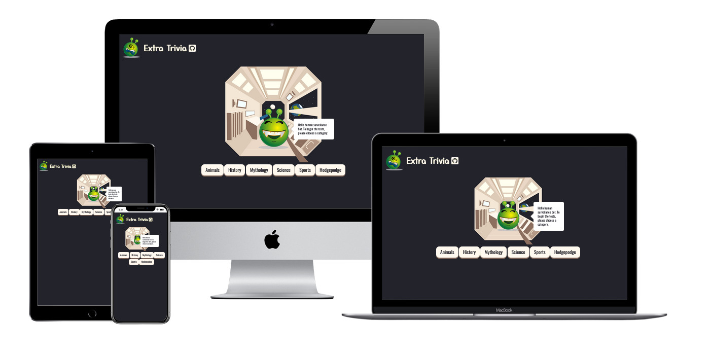

<h1 align="center">MS2</h1>

This is a trivia website using the jService api and string-similarity api. Designed to be eye-catching, responsive & interactive.

## User Experience

### User Journey

1. The user begins at the Homepage and should see the simple instructions "Hello, human surveillance bot. To begin the tests, please choose a category. " which are presented by our alien host.

1. Upon clicking a category the host then prompts the user to start the quiz using the 'Start Quiz' button.
1. This will cause the host to ask his first question. The user can then enter their answer into the form and submit with the 'Submit' button.

1. The host will then determine whether the user is correct or incorrect.
 - If correct, The user will be allowed to continue to the next question and the quiz will continue. 

 

 - If incorrect, then unfortunately the users run is over. A popup appears giving feedback to the user and prompts them to play again.

 

### User Stories

- First Time Visitor
    - When I visit this site I want to understand how I can interact with the website.
    - I would want to attempt the quiz in a category of my choice.
- Returning Visitor
    - As a returning visitor I may simply be looking to improve my score or try a new category.
    - I may also want to share my interest in the site via social media.
- Frequent User
    - As a frequent user I would consistently be looking to improve my score.
    - I may also be interested in the developent of the game.

### Design

- Colour Scheme
    - This will likely be dictated by the creative elements that I find. So with that in mind I chose a background color that would blend with the central image. Any buttons and text I will try to use colors from the image so that we have a constistent theme.
- Typography
    - I used Yusei Magic for the header and Oswald elsewhere.
- Imagery
    - I found a selection of emoji expressions that I thought would work well at different moments during a playthrough (correct/incorrect etc.). These emojis happened to be of an alien so I decided to theme my website around space.

- Wireframes
    - I created wireframes for the basic ideas I had and then added more details as I went along. I also made a flowchart to help me envision the steps taken during a playthrough of the quiz.
        - [Home page](documentation/Wireframe/MS2-Wireframe-Homepage.pdf)
        - [Question Page](documentation/Wireframe/MS2-Wireframe-Question.pdf)
        - [Recap Page](documentation/Wireframe/MS2-Wireframe-Recap.pdf)
        - [Flowchart](documentation/Wireframe/MS2-Wireframe-Flowchart.pdf)

## Features

- The website should be responsive across different devices.
- The website will be very interactive and lenient towards user error.

### Taking The Project Further

If I were taking the project further there are some features I believe would the website would benefit from:
- I would like the website to record the users previous attempts so they can see their own improvement.
- Although the social media icons do lead to their respective websites, I would like a more complete share system that writes a post for the user.

## Technologies

### Languages

- [HTML5](https://en.wikipedia.org/wiki/HTML5)
- [CSS3](https://en.wikipedia.org/wiki/CSS)
- [JS](https://en.wikipedia.org/wiki/JavaScript)

### API's Used

#### [jService](http://jservice.io/)
jServie is a simple trivia service that serves the answers/questions pulled from jArchive. The questions are organised into categories which we can use to make a series of themed questions for the user of this website.
- JSON of a category: [JSON](https://jservice.io/api/category?id=21)
- JSON of a random question: [JSON](http://jservice.io/api/random)

#### [StringSimilarity](https://www.npmjs.com/package/string-similarity#for-nodejs)
String Similarity finds the degree of similarity between two strings, based on Dice's Coefficient. Returning a fraction between 0 and 1, which is what indicates the similarity of the strings. We can use this in our website to allow for a users minor spelling mistakes.

### Frameworks, Libraries & Programs Used

1. [jService](https://github.com/sottenad/jService): A trivia API

1. [String-Similarity](https://github.com/aceakash/string-similarity#readme): For testing user answer versus correct answer.

1. [Fetch](https://developers.google.com/web/updates/2015/03/introduction-to-fetch): To access the jService API.

1. [Bootstrap4.5.2](https://getbootstrap.com/): Basic Styling; (sr-only).

1. [Gitpod](https://www.gitpod.io/): Code is written with Gitpod and used for version control via the terminal to commit to Git and push to GitHub.

1. [Github](https://github.com/): GitHub is used to store the project after being pushed from Git.

1. [Google Fonts](https://fonts.google.com/?query=Oswa): Used to import various fonts.

1. [Font Awesome](https://fontawesome.com/): Added icons to popup menu.

1. [Balsamiq](https://balsamiq.com/): For wireframes and flowchart.

## Testing

The W3C Markup Validator and W3C CSS Validator Services were used to validate pages of this project. This ensures there were no syntax errors. I also used formatters for my HTML, CSS & JS.

#### Validators
-   [W3C Markup Validator](https://validator.w3.org/) - [Results](documentation/images/html_valid.png)
-   [W3C CSS Validator](https://jigsaw.w3.org/css-validator/) - [Results](documentation/images/css_valid.png)

#### Formatters

- [HTML Formatter](https://www.freeformatter.com/html-formatter.html)
- [CSS Formatter](https://www.freeformatter.com/css-beautifier.html)
- [JS Formatter](https://beautifier.io/)

### Testing User Journey
1. Upon entering the site you are presented with the option to choose a category.
- When a button is clicked that category is chosen.
- This correctly prompts the UI, hosts facial expression and hosts speech to change.
- the 'Start Quiz' button is then displayed.

1. Upon clicking a category the host then prompts the user to start the quiz using the 'Start Quiz' button.
- Upon clicking this button a question is asked.
- Much like the category choice buttons this also prompts the UI, hosts facial expression and hosts speech to change.

1. This will lead to the host asking his first question. The user can then enter their answer in the form and then submit with the button.
- When entering text into the form you can either submit with the enter key or by pressing the 'Submit' button.
- Both methods work as expected.
- The answer is then checked and appropriate changes to UI, hosts facial expression and hosts speech occur.

1. The host will then determine whether the user is correct or incorrect.
- If correct: The 'Next Question' button appears which serves the same purpose as the 'Start Quiz' button. Relevent changes to the UI, hosts facial expression and hosts speech occur.
- If incorrect: The popup appears and other cosmetic changes occur as expected. The popup correctly displayed the information and offers the user the option to play again.
- Clicking the play again button reloads the page and starts the process again.

### Testing User Stories

- First Time Visitor
    - When I visit this site I want to understand how I can interact with the website.
        1. Upon entering the site you see the header and title which should hint towards the content of the site.
        1. At this point the user would notice the quiz host who welcomes the user and suggests they choose a category to begin their test.
    - I would want to attempt the test/quiz in a category of my choice.
        1. After a category is chosen the quiz begins and the user can attempt to get as large a score as possible.
        1. Once the quiz reaches its conclusion the user is prompted to have another go or get in touch.
- Returning Visitor
    - As a returning visitor I may simply be looking to improve my score or try a new category.
        1. This is as easy upon returning as it was the first time.
    - I may also want to share my interest in the site via social media.
        1. A repeat user may be more inclined to share their interest which they get the option to do at the end of the quiz.
- Frequent User
    - As a frequent user I would be consistently be looking to improve my score in the quiz.
        1. If I took the project further I would include a leaderboard, however at this moment the user would have to remember their own score.
    - I may also be interested in the developent of the game.
        1. The user can find a link to the github repository in the header.

### Further Testing

- So far testing has been on safari, firefox, and chrome.
- The website was viewed on a variety of devices such as a Laptop, iPhone, and Ipad.
- Friends and family members were asked to explore the site and documentation to point out any bugs or issues they spot.

### Known Bugs

Users have occured a bug where the question does not appear in the speech bubble after selecting a category or after answering a question.
- This seems to have only happened on mobile so far.
- The same users have been unable to repeat the bug.

I currently think it could be an empty element in the category data. However, since the bug has not happened on desktop I have not had a chance to use developer tools to investigate it.

## Deployment

### Github Pages

The project was deployed to GitHub Pages using the following steps:

- Log in to GitHub and locate the GitHub Repository.
- At the top of the Repository find the "Settings" button on the menu.
- Scroll down the Settings page until you locate the "GitHub Pages" Section.
- Under "Source", click the dropdown called "None" and select "Master Branch".
- For the folder selection we selected "Root".
- The page will automatically refresh.
- Scroll back down through the page to locate the now published site link in the "GitHub Pages" section.

## Credits

### Code & Media

The space to share any resources I have used to help me build this project.

1. [jService](https://github.com/sottenad/jService) The API I used to get my questions.

1. [String-Similarity](https://github.com/aceakash/string-similarity#readme) The API I used to check user answers against the correct answers.

1. [Fetch](https://developers.google.com/web/updates/2015/03/introduction-to-fetch) To access the jService API.

1. [Button](https://www.w3schools.com/csS/css3_buttons.asp) To get the button press effect.

1. [Pixabay](https://pixabay.com/) Used for quiz host images.

1. [Shutterstock](https://www.shutterstock.com/home) Space Vessel Interior (Background).

1. [Ben Chao](https://codepen.io/anshing97/pen/qFDBK) Used speech bubble left.

1. [Bootstrap4.5.2](https://getbootstrap.com/): Bootstrap Library used for some basic styling.

1. [Multi Media Mockup](https://techsini.com/multi-mockup/): For the README.

### Acknowledgements

- My Mentor Aaron Sinnott for the helpful feedback.
- Scott & Alan from tutor support at Code Institute.